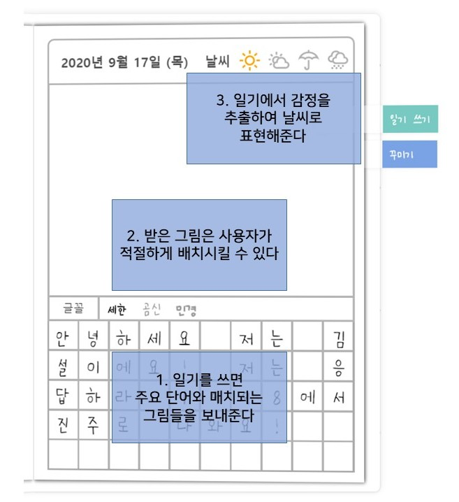

# 니가그린 그림일기 

> 글은 내가 쓸게 그림은 누가 그릴래?

<br>

# 기획 의도
- 힘들고 지친 젋은이들의 감성 자극
- 어릴 적 동심을 되살려보자
- 하루하루 간단한 기록을 남겨보는 건 어떨까?
- 직접 그리지 않아도 그림이 그려지면 편할 것 같다
- 일상을 공유하자
- 나의 일기를 AI는 어떻게 생각할까?

<br>

# 주요 기능
### 일기 쓰기
- 단어 추출 후 단어에 맞는 그림 제공
- 일기 내용을 통한 감정 분석
### 아카이브
- 달력에서 모아보기
- 내가 언제 일기를 썼을까?
### 공유하기
- 귀엽고 남이 그려준 그림일기를 공유해보아요
### 단어 추출
- 우선 순위별 단어 추출
- 인공지능으로 중요 단어 선별
### 감정 분석
- 기쁨 화남 슬픔등 일기의 감정을 분석해 표현
- CNN, LSTM, BERT, SVM 등 사용해 실험 중
### 사진을 그림으로 변경
- tensorflow object detection api 사용 객체 검출
- 라벨링 된 객체를 그림과 mapping

<br>

# 목업


<br>

# 개발 환경 설정
## Backend
### 1) virtualenv 라이브러리 설치
```
pip install virtualenv
```
### 2) virtualenv 명령을 통한, 가상환경 생성
```
virtualenv 가상환경이름

# 파이썬 버전 지정하여 생성하기
virtualenv 가상환경이름 --python=python3.7 
```
현재 디렉토리에 가상환경이름 으로 디렉토리가 생성이 됩니다.

### 3) 생성된 가상환경 활성화
맥/리눅스와 윈도우는 쉘환경이 다르기 때문에, 활성화 방법이 다릅니다.
```
# Window
가상환경이름/Scripts/activate

# Mac/Linux
source 가상환경이름/bin/activate
```
지금부터 pip를 통해 설치하는 모든 라이브러리는 가상환경이름 디렉토리 내에 모두 설치가 됩니다. 고로 다른 가상환경의 라이브러리가 버전 충돌이 일어나지 않습니다.

그리고 python 명령을 사용되는 라이브러리도 가상환경이름 내 라이브러리를 사용하게 됩니다.

### 4) pip 명령을 통해, 필요한 라이브러리 설치
```
# requirements.txt 내에 명시된 라이브러리들을 한 번에 설치하기
pip install --requirement requirements.txt
# 혹은
pip install -r requirements.txt
```
### 5) 현 가상환경 내에서 프로젝트 개발
### 6) deactivate 명령으로 현재 가상환경 비활성화
```
deactivate
```

<br>

## Frontend
```
npm install
```

### Compiles and hot-reloads for development
```
npm run serve
```

<br>

# 개발
## 2학년1반
### 최윤주
### 고유진
### 김지현
### 김형준
### 정무영

<br>

## 기간
2020.08.31 - ~ing

<br>

## 사용 기술
### Django REST Framework
### Vue.js
