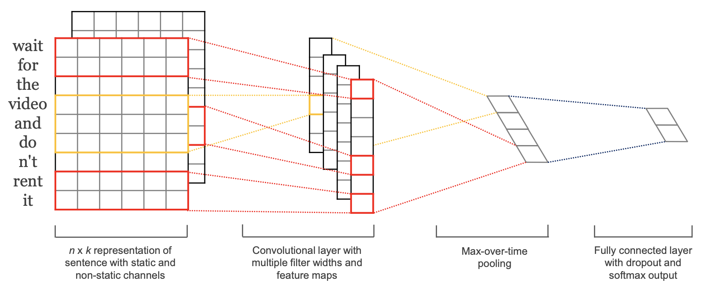
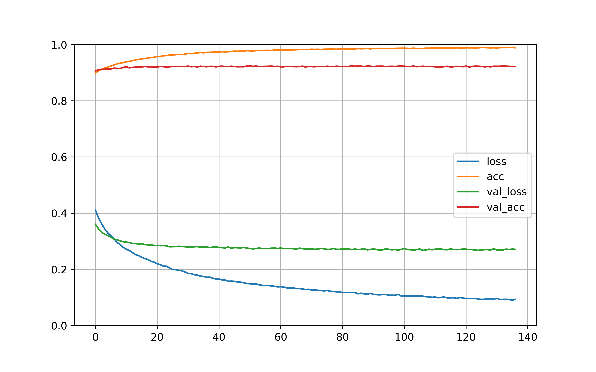

## 뉴스 댓글 감정 분류 모델

- 다음(Daum) 뉴스 포탈에서 수집한 댓글 데이터 2,393,070개에 대한 6가지 감정 분석
- 2018년 KHCI 학회 Best Poster Award
	- 한재호, 김우정, 한경식. (2018). 인터넷 뉴스 댓글 기반의 다중 감정 분석 모델 개발 및 적용. 한국HCI학회 학술대회, (), 893-897.
- 2018년 한국차세대컴퓨팅학회 최우수 논문 선정

## Requirement
- tensorflow 2.2.0
- keras 2.4.3
- gensim 3.8.1
- konlpy 0.5.2
---

### 1. 데이터 수집 및 전처리
- 뉴스 데이터 크롤링
- 뉴스의 댓글 데이터로 word embedding model 만들기 
	- 댓글 토큰화 and 특정 품사만 추출 
	- konlpy Twitter (Okt) 패키지 기준 ['Noun', "Verb", 'Adjective', "Adverb", "Determiner", "Exclamation", "Emotion"]
		- word2vec
		- fastText 
	- 자모 단위 토큰으로 학습된 fastText용
- [[Code]](https://github.com/woodongk/Daum-News-Comments_Sentiment_Analysis/blob/master/01.%20Word%20Embedding.ipynb)

### 2. 댓글에 감정 레이블 부여하기 

초기 버전의 연구에서는 크라우드 소싱을 통한 감정 레이블 작업을 하였지만, 크라우드소싱 방법은 연구를 확장시키기에 어려움이 커서 이후 감정사전을 통한 레이블 방법을 이용.

- (참고용) 크라우드 소싱에 사용된 감정 라벨 기준   
    1.	감정동사 434개의 목록을 19가지의 감정으로 분류한 논문과 Word2Vec을 바탕으로 우리만의 labeling 분류 기준을 만들었다.
    2.	[기쁨, 슬픔, 놀람, 공포, 혐오, 분노] 6가지 감정에 대한 기준 틀을 위 페이지에 만들어 놓았고, 저 기준 틀을 바탕으로 댓글을 6가지 감정으로 labeling 한다.
    3.	One label로 annotation 한다. (한 댓글에서 다수의 감정 느껴져도 한 가지 감정으로 annotate)
    4.	최대한 6가지 감정으로 분류한다. (기쁨이나 혐오로 label 몰리지 않게)
    5.	그러나 감정 label annotation을 하다 보면 6가지의 감정으로 뚜렷하게 분류할 수 없는 경우가 존재한다.
    
        - 다수의 감정이 느껴질 경우/ 특정한 한 가지 감정으로 분류하기 힘든 경우
          	- 분노와 혐오가 언어적 특성에서 많이 겹치기 때문에, labeling을 하다 보면 명확하게 두 감정이 구분이 되지 않는 경우가 다수 존재. 따라서 분노와 혐오의 구분을 명확히 하기 위해 댓글에서 {욕, 과격한 단어, 공격적인 단어, 비속어}가 나타날 시에는 분노 그 외에는 혐오로 labeling한다.
            - 비교적 표본 개수가 많은 [기쁨, 분노, 혐오]와 [슬픔, 놀람, 공포]이 동시에 느껴질 경우 [슬픔, 놀람, 공포]의 감정으로 labeling 한다. ([슬픔, 놀람, 공포]의 표본 개수가 상대적으로 부족)   
        - 6 가지 감정으로 labeling할 수 없는, 감정을 판단하기 불가능한 댓글은 따로 ‘7’으로 labeling한다. 
			
				(a) 자신의 의견 
	
					예시 1) 조만간 Bada tv 에서 봅시다. 
					예시 2) 투표 잘 해야지
					예시 3) 씨앗을 뿌렸으면 싹이 나고 꽃이 피고 열매를 맺는 건 순리이고 진리이다
					예시 4) 50대 6070 대도 마찬가지
	
	            (b) 정책 제시
	
					예시 1) 주거용으로 한집 소유한 사람은 재산세 내리고 두 채 이상 소유한 사람은 세금 더 내게 하시길.... 더욱 더 강한 법을 만들어야 합니다, 
					예시 2) 중장기적으로는 (보유세 인상)으로 갈 수밖에 없을 것이다.   부동산 업계에서는 양도세 중과세가 적용되는 내년 4월 이후가 될 가능성이 높다는 전망이 나온다. 양도세 중과세 방침에도 불구하고 다주택보유자들이 집을 내놓지 않을 경우 (보유세 인상) 카드를 꺼낼 가능성이 높다고 보는 것이다."  다주택 투기군에 대한 (종부세 인상)이 시급하다.
					예시 3) 부동산 안정대책은 2채이상 보유하면 보유세 과세해야함 무조건 이유불문 국민들 90% 이상 이제도에는 찬성할 것임 

	            (c) 아무 의미 없이 적은 댓글 

					예시 1) 경찰 여자
					예시 2) 하트?
        - 한 댓글에 극단적인 두 가지 감정이 느껴지는 댓글 (분노, 기쁨)
            
				예시 1) 뭐든 잘됐으면 좋겠다. 저 여자보다 더 노력하며 살기나하냐 악플러들아 
				예시 2) 백날 그런 소리 해봐야 소용없습디다. 지난 2012년 우리 지역과 똑같은 일이 그쪽에서 벌어졌네요. 그때 시는 제대로 대응 못했다는 것, 그래서 인재라는 것 시민 다 아는데 그래서 엄청 수해를 입었는데 법에 호소해 봤지만 법원에서는 천재지변이라고 결론 나고 시는 수해를 심하게 당해 고통받는 사람에게 소송비용이 발생했으니 비용 물어내라고 천이백만원 인가 받아갔습니다. 정말 안타까운 일이지만 잘 이겨 나가시길 바랍니다.

- 감정사전
    - 참고문헌 : 홍종선, 정연주. (2009). 감정동사의 범주 규정과 유형 분류. 한국어학, 45(), 387-420.
    - 감정동사를 Ekman의 6가지 감정(‘기쁨’, ‘슬픔’, ‘혐오’, ’놀람’, ‘공포’, ‘분노’) 으로 분류하여 감성사전 구축
    6 emotion : happy, sad, disgust, angry, surprised, fear
    - [[Code]](https://github.com/woodongk/Daum-News-Comments_Sentiment_Analysis/blob/master/02.%20Labeling%20Emotions%20on%20Comments.ipynb)

### 3. Text-CNN 모델 구축
모델 학습에는 word2vec pretrained model만을 사용하였다. 김윤 박사님의 논문과 여러 레퍼런스를 참고하여 구현하였다.



### 2D CNN Parameter
```bash
- sequence_legnth: 20
- num_classes: 6, [happy, sad, disgust, angry, surprised, fear]
- vocab_size: 168,620
- embedding_size: 300
- filter_sizes: [3, 4, 5]
- num_filters: 100
````
- [[Code]](https://github.com/woodongk/Daum-News-Comments_Sentiment_Analysis/blob/master/03.%20Train%20CNN%20model.ipynb)

#### 학습 곡선 


- 학습 결과를 보면 6가지 분류 문제임에도 한번의 학습에 높은 val_accuracy를 보여준다. 본 모델의 학습데이터를 만들 때 감정 단어를 이용하였고, pretrained model로 word2vec 모델을 사용했다. 사전에 word2vec 모델에 단어 임베딩이 잘 형성되었기에 단어에 종속되는 학습 데이터 특성 상 높은 수치가 나왔다고 생각된다.

### Reference
- [Kim, Y. (2014). Convolutional neural networks for sentence classification.](https://arxiv.org/abs/1408.5882)
- [CNN in keras with pretrained word2vec weights | Kaggle](https://www.kaggle.com/marijakekic/cnn-in-keras-with-pretrained-word2vec-weights)
- [Using pre-trained word embeddings in a Keras model](https://blog.keras.io/using-pre-trained-word-embeddings-in-a-keras-model.html)
- [Implementing a CNN for Text Classification in TensorFlow – WildML](http://www.wildml.com/2015/12/implementing-a-cnn-for-text-classification-in-tensorflow/)

### Contact
- 김우정 [gks3284@ajou.ac.kr]
- 한재호 [woghrnt2@ajou.ac.kr]
